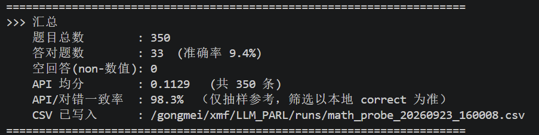
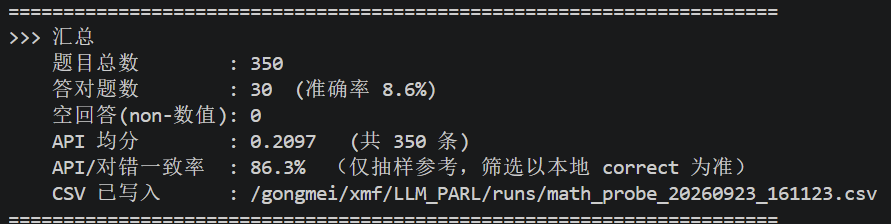
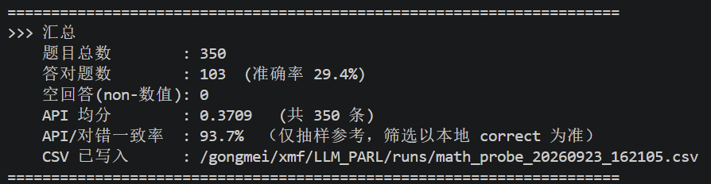

## 300条训练集 && 50条验证集 && PARL30条数据 && 无采样 效果记录

### 数据集weitianwen/cmath


default.yaml
```python
algorithm:
  K: 1
  M: 1
  N: 1
  cg_iters: 1
  inner_updates: 1
  num_train_epochs: 1
  outer_iterations: 30
  reward_model_epochs: 1
  teacher_forcing_batch_size: 1
elite_selector:
  class_path: src.evolution.base.EliteSelector
  kwargs: {}
environment:
  class_path: src.environments.base.Environment
  kwargs: {}
extra:
  data_path: data/cmath_350.json
  deterministic_eval: false
  email_pass: fcoboqomddvhfiic
  email_receiver: 1148831701@qq.com
  email_user: 1148831701@qq.com
  eval_every: 1
  eval_questions: 50
  note: 数学数据集 PPO 主流程配置（Qwen2.5-0.5B，data/cmath_350.json）
  output_dir: runs
  wandb_enabled: true
  wandb_project: PPO-Main
metric:
  class_path: src.metrics.base.Metric
  kwargs: {}
parallel_executor:
  class_path: src.parallel.serial.SerialExecutor
  kwargs: {}
q_provider:
  class_path: src.q.base.QProvider
  kwargs:
    dataset_name: data/cmath_40.json
    max_samples: 350
qwen_module:
  class_path: src.llm.qwen_module.QwenModule
  kwargs:
    actor_device: cuda:0
    actor_learning_rate: 2e-6
    bf16: true
    critic_learning_rate: 1e-6
    do_sample: false
    generate_max_len: 768
    generate_on_cpu: false
    gradient_checkpointing: true
    init_kl_coef: 0.08
    mini_batch_size: 64
    parl_device: cuda:2
    ppo_micro_batch_size: 30
    pretrain: /gongmei/xmf/model/base/Qwen2.5-0.5B-Instruct
    prompt_max_len: 768
    ref_device: cuda:1
    repetition_penalty: 1.15
    temperature: 0
    top_p: 1.0
    train_batch_size: 1
    use_ref_model: true
scorer:
  api_auth_header: bearer
  api_base: https://www.rightapi.ai/v1
  api_batch: 30
  api_concurrency: 30
  api_model: gemini-3-flash-preview
  api_retries: 5
  api_timeout: 60
  provider: rightapi
  use_api: true
  verbose_scores: true
seed: 42


```


### 曲线图


### ai打分曲线图


### 基类模型回答正确数


### 测试loss最小即13轮时的模型回答正确数


### 测试平均分最高即第6轮的模型回答正确数



## 分析

### 现象：第六轮开始loss下降，但分数也下降  <br>
### 原因：无采样导致过拟合出现局部最优或者退化循环，api不稳定部分样本打分出现api调用失败 <br>

### ai所分析的可能的bug（已经过验证）： <br>

*   **滑动窗口索引错位**
    *   **现象**：程序逻辑中，先生成所有历史样本的 Hidden States，随后执行滑动窗口截断 (`-MAX_WINDOW_SIZE`)。
    *   **原因**：截断后 `Accumulated_Data` 的第 $i$ 条是最新数据，但 `Hidden States` 列表的第 $i$ 条却是最旧数据。
    *   **后果**：模型用“旧数据的奖励”去训练“新产生的采样”，喂给模型的是完全虚假的梯度信号，导致训练必然崩塌。


